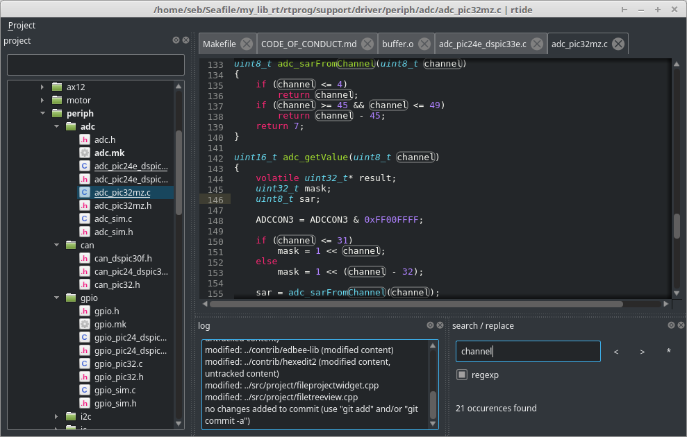

# RtIDE

[](http://www.gnu.org/licenses/gpl-3.0)
[](https://travis-ci.org/UniSwarm/rtide)
[](https://ci.appveyor.com/project/sebcaux/rtide-ad76d)

A simple IDE for [RtProg](https://github.com/UniSwarm/rtprog) written in Qt5. This IDE want to be very lightweight and fast to load without a huge project management system.

Still in development.



## Features

* files project viewer with git integration
* code highlighting (based on [edbee](https://github.com/edbee/edbee-lib))
* hexadecimal editor (based on [qhexedit2](https://github.com/Simsys/qhexedit2))
* dark theme to preserve developer eyes :wink: (based on [QDarkStyleSheet](https://github.com/ColinDuquesnoy/QDarkStyleSheet))
* Makefile parser to extract external sources and rules
* compile log with link to file
* image viewer
* HTML live preview

## Build

```
mkdir build
cd build
qmake ../src
make -j
```

Binaries will be placed in `bin/` directory.
